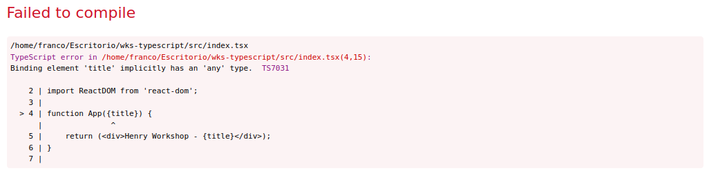
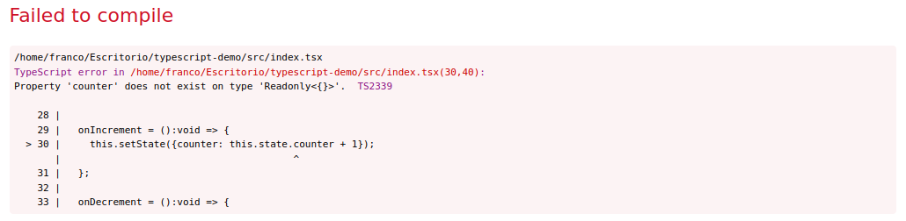
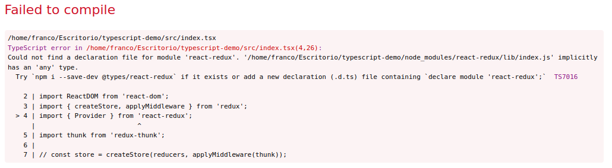
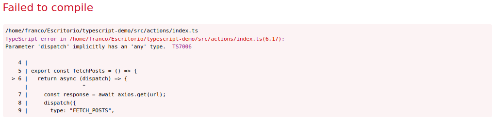
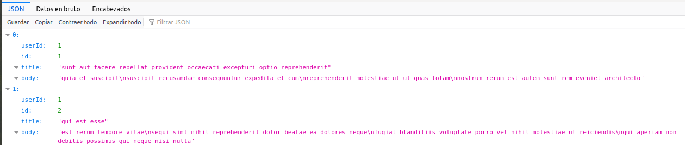
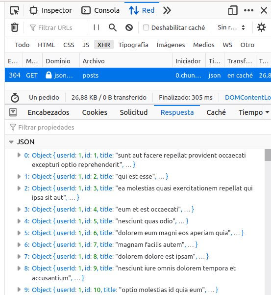
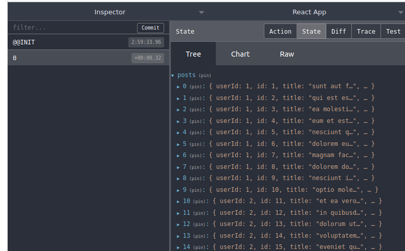
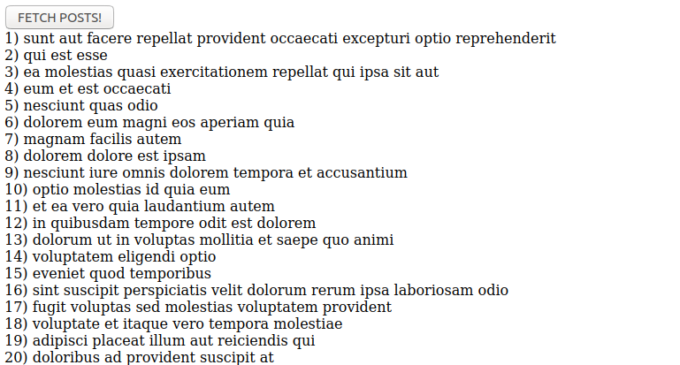

# Henry Workshop - Typescript

## Overview

En este workshop vamos a crear una aplicación utilizando React, Redux, express y Typescript.
Primero comenzamos por el front-end, usaremos el script de Create React App para generar un boilerplate inicial y sobre el modificar lo necesario para elaborar la aplicación que se describirá a continuación.

## Setup Inicial

Para crear la estructura de proyecto se ejecuto el comando

```bash
  npx create-react-app wks-typescript --template typescript
```

Si quieren iniciarlo desde cero pueden volver a hacerlo o directamente forkear este repositorio y trabajar a partir de eso. De elegir esta segunda opción no olviden de realizar el `npm install` para instalar las dependencias necesarias para correr el proyecto.

Para simplificar un poco la estrucutra que genera el script de React se eliminaron los archivos innecesarios por lo que para comenzar van a tener que crear la carpeta `src` y allí ir colocando los archivos necesarios.

## WARM UP

### Componentes

Una vez creada la carpeta `src` vamos a crear nustro componente principal como ya sabíamos en React, sin nada nuevo por lo que simplemente crearemos el archivo `index.tsx` (extensión tsx en vez de jsx al ser Typescript) dentro de la carpeta `src` con el siguiente código:

```javascript
import React from 'react';
import ReactDOM from 'react-dom';

function App() {
 return <div>Henry Workshop - Typescript</div>;
}

ReactDOM.render(<App />, document.querySelector('#root'));
```

Si ejecutamos `npm start` ya tendremos nuestra aplicación corriendo de forma local.

#### Props

Intentemos ahora pasarle como hacíamos en React una prop a ese componente por ejemplo una llamada title que contenga la palabra "Typescript".

```javascript
function App({title}) {
 return <div>Henry Workshop - {title}</div>;
}

ReactDOM.render(<App title="Typescript" />, document.querySelector('#root'));
```

Si vamos a nuestra aplicación veremos lo siguiente:



Como ya vimos durante la parte teórica, en Typescript necesitamos informar los tipos de datos que vamos a utilizat, en este caso de las propiedades que va a recibir cada componente, para ello utilizaremos una `interface`. Adicionalmente es una buena práctica si utilizamos componentes funcionales determinar el tipo de dato que va a retornar dicha función y no dejarlo libre para que Typescript haga la inferencia de datos. En este caso lo que estamos retornando es un JSX por lo que agregamos `JSX.Element`.

_NOTA: Recuerden que este error lo está arrojando porque en el archivo tsconfig.json tenemos seteado el flag strict en true por lo que no va a permitir inferencias al tipo any en ninguna parte de nuestra aplicación pero si lo modificamos a false, va a compilar correctamente_

```javascript
interface AppProps {
  title: string;
}

function App({title}:AppProps): JSX.Element { // Sin el destructuring sería App(props:AppProps)
  ...
}

// O con otra sintaxis
const App = ({title}: AppProps): JSX.Element => {
  ...
}
```

¿Qué ocurriría si existen propiedades opcionales que pueden pasarse o no? Más adelante veremos como solucionar este problema pero si prueban verán que tendremos un problema al momento de compilar. Si sacamos la prop title del llamado al componente tendremos el siguiente error: `Property 'title' is missing in type '{}' but required in type 'Readonly<AppProps>'.`

#### State (Class vs Hooks)

Si utilizamos `Hooks` el código va a quedar más sencillo ya que no vamos a tener que preocuparnos por definir la estructura de tipos que debe seguir el estado del componente, simplemente utilizamos el hook de `useState` al igual a como ya estábamos acostumbrados.

```javascript
function App({title}: AppProps) {
 const [counter, setCounter] = useState(0);

 return (
  <div>
   <h3>Henry Workshop - {title}</h3>
   <hr></hr>
   <button onClick={() => setCounter(counter + 1)}>Increment</button>
   <button onClick={() => setCounter(counter - 1)}>Decrement</button>
   <br></br>
   <span>{counter}</span>
  </div>
 );
}
```

Por el contrario si hacemos el mismo componente pero utilizando `Class` como ya sabíamos de React nos quedaría algo así:

```javascript
class App extends React.Component<AppProps> {
 constructor(props: AppProps) {
  super(props);
  this.state = {counter: 0};
 }

 onIncrement = (): void => {
  this.setState({counter: this.state.counter + 1});
 };

 onDecrement = (): void => {
  this.setState({counter: this.state.counter - 1});
 };

 render() {
  return (
   <div>
    <h3>Henry Workshop - {this.props.title}</h3>
    <hr></hr>
    <button onClick={this.onIncrement}>Increment</button>
    <button onClick={this.onDecrement}>Decrement</button>
    <br></br>
    <span>{this.state.counter}</span>
   </div>
  );
 }
}
```

Si analizamos el código es totalmente válido para una aplicación de React, pero al parecer Typescript no estaría muy de acuerdo con eso, ya que al intentar levantar la aplicación nos arrojará este error:


Lo que nos está faltando para evitar este error es declarar la estructura de tipos del estado del componente de la siguiente forma:

```javascript
interface AppState {
  counter: number;
}

class App extends React.Component<AppProps, AppState> {
  constructor(props: AppProps) {
      super(props);
      this.state = {counter: 0};
  }

  ...
}
```

Existe otra posibilidad para simplificar la sintaxis del código en el caso de utilizar `Class` que es la siguiente. Sin definir la interfaz del state podemos sobreescribir state dentro del componente:

```javascript
class App extends React.Component<AppProps> {
  state = {counter: 0};

  ...
}
```

## Enunciado

Lo anterior fue simplemente para practicar el armado de un componente ya sea funcional o de clase pero ahora lo que vamos a intentar hacer es una aplicación utilizando también Redux que consuma una API que vamos a crear con express y muestre los resultados obtenidos. Por lo tanto los componentes que habíamos hecho hasta recién lamentablemente no van a servirnos más por lo que pueden ya eliminarlos y comenzar nuevamente de cero.


## Back-end

### Dependecias

Primero creamos una carpeta que se llame api, y en la consola usamos el siguiente ocomando:

```bash
  npx tsc --init
```

¿Qué realiza ese comando? Nos genra un archivo llamado tsconfig.json, en el cual vamos a configurar nuestro compilador. Dentro nos vamos a encontrar diferentes, las mas importantes que tenemos que revisar son:

```javascript
    "target": "es6",
    "module": "commonjs",
    "outDir": "./dist",
```

Esas son las configuraciones que va a realizar el compilador para convertir nuestro codigo typescript a javascript para que node lo pueda entender. Target es el standard, commonjs es el modo como van a generarse los modulos y outdir es la carpeta donde se va a guardar nuestro codigo typescript.
Para poder utilizar la libreria de sequelize, es necesario que habilitemos los decoradores y utilicemos ES6, por lo que dejamos target en "es6" y activamos las siguientes opciones:

```javascript
    "experimentalDecorators": true,
    "emitDecoratorMetadata": true,
```

Ahora procedemos a generar nuestro package.json, utilizando el comando:

```bash
npm init
```

Le colocamos el nombre que deseemos, y comenzamos a instalar dependencias:

Instalamos lo que usariamos normalmente en una aplicación de express

```bash
npm i cookie-parser cors dotenv express pg sequelize sequelize-typescript typescript
```

Y realizamos otra instalación, noten acá que tambien estamos instalando dependencias con @types ¿Qué son estos @types?
Asi como nosotros tenemos que agregarle los tipos a todos nuestros objetos y funciones, las librerias tambien, entonces necesitamos instalarlas.
Además estamos instalando ts-node, que es el que nos va a permitir utilizar nodemon con typescript!

```bash
npm i @types/cookie-parser @types/cors @types/express @types/morgan @types/node @types/pg morgan nodemon ts-node --save-dev
```

Ahora modificamos nuestro script, agregamos el comando

```javascript
  "scripts": {
    "dev": "nodemon index.ts"
  },
```

Ahora creemos nuestro index.ts en nuestra carpeta api y ya podemos comenzar!

Ese va a ser nuestro punto de entrada, basicamente, es donde vamos a usar nuestro app.listen y sequelize.sync, antes de eso, creemos una carpeta que se llame src, y ahi dentro creemos nuestro app.ts y comencemos a configurar nuestra aplicacion de express!

```javascript
import express from 'express';
const app = express();
export default app;
```

Primero podemos notar dos cosas, uno, podemos usar es6 dentro de node.js, y que, dependiendo de nuestra configuracion, app probablemente nos este dando un error ¿Por qué? Porque le faltan los tipos! Entonces:

```javascript
import express, {Application} from 'express';
const app: Application = express();
export default app;
```

Lo que estamos haciendo ahi, es decirle nuestra variable app que es una Application de express. Ahora, seguro estas pensando ¿Como hago yo para saber eso? Simple! Esta en la documentacion. Casi todos los paquetes de npm tienen soporte para typescript, algunos hasta estan escritos en TS!

Antes de continuar, seteemos nuestras variables de entorno, para eso, hagamos un archivo de configuracion. Creemos una carpeta llamada lib, y dentro de ella un archivo que se llame config.ts

Adentro de config.ts, vamos a obtener nuestros valores de las variables de entorno:

```javascript
import dotenv from 'dotenv';

dotenv.config();

const config = {
 dbUser: process.env.DB_USER || 'postgres',
 dbPassword: process.env.DB_PASSWORD || '1234',
 dbHost: process.env.DB_HOST || 'localhost',
 dbName: process.env.DB_NAME || 'workshop',
 dbPort: process.env.DB_PORT || '5432',
 dev: process.env.NODE_ENV !== 'production',
 port: process.env.API_PORT || '3001',
 host: process.env.API_host || 'localhost',
 cors: process.env.CORS || 'localhost:3000',
};

export default config;
```

Para esto, tambien deberiamos crear nuestro archivo .env, de la siguiente manera:

```bash
DB_USER="postgres"
DB_PASSWORD="1234"
DB_HOST="localhost"
DB_NAME="workshop"
DB_PORT="5432"
NODE_ENV="development"
API_PORT="3001"
API_HOST="localhost"
CORS="http://localhost:3000"
```

Ahora seteemos nuestros headers y cors,

```javascript
import express, {Application} from 'express';
import config from './lib/config';

const app: Application = express();
app.use(express.urlencoded({extended: true, limit: '50mb'})); //middleware
app.use(express.json({limit: '50mb'}));
app.use(cookieParser());
app.use(morgan('dev'));

app.use(
 cors({
  origin: config.cors,
  credentials: true,
  methods: ['GET', 'POST', 'OPTIONS', 'PUT', 'DELETE'],
  allowedHeaders: ['Origin', 'X-Requested-With', 'Content-Type', 'Accept'],
 })
);

app.use((err, req, res, next) => {
 // eslint-disable-line no-unused-vars
 const status = err.status || 500;
 const message = err.message || err;
 console.error(err);
 res.status(status).send(message);
});

export default app;
```

Nuestro middleware de control de errores nos esta dando problemas, necesita que le especifiquemos su tipado!
Entonces, tenemos que obtener de express NextFunction, Request y Response, pero ¿Y err?
Bueno, no existe un tipado para los errores, existen varias formas de resolver ese problema. Principalmente porque los errores se declaran de distinta forma dependiendo de su origen.
La forma mas sencilla es que hagamos una interface!

```javascript
import express, {Request, Response, NextFunction} from 'express';

//-----------------------------------

interface error {
 status: number;
 message: string;
}
app.use((err: error, req: Request, res: Response, next: NextFunction) => {
 // eslint-disable-line no-unused-vars
 const status = err.status || 500;
 const message = err.message || err;
 console.error(err);
 res.status(status).send(message);
});
```

Genial, ahora lo que tenemos que hacer es probar nuestra configuracion, para eso generamos una ruta!

```javascript
app.get('/', (req: Request, res: Response) => {
 res.send('hola typescript!');
});
```

Y en nuestro archivo index.ts, el que esta en la carpeta raiz:

```javascript
import app from './src/app';

app.listen(3001, function () {
 console.log('App is listening on port 3001!');
});
```

Como pueden ver, la unica diferencia con express normal es que tenemos que agregar ciertos tipados! Probamos que funcione, y debuggeamos nuestro código.

Una vez que funcione, creamos nuestra carpeta routes!
Todavía no te conte que tipo de app vamos a hacer, la idea es hacer modelo de usuario con nombre y apellido.
Entonces, en la carpeta routes creamos nuestro index.ts y user.ts
En user.ts generamos nuestras rutas!

```javascript
import {Response, Request, Router} from 'express';

router.get('/', (req: Request, res: Response) => {
 res.send('soy la ruta get!');
});

router.post('/', (req: Request, res: Response) => {
 res.send('soy la ruta post!');
});

export default router;
```

Y en nuestro index.ts dentro de la carpeta routes:

```javascript
import {Router} from 'express';
import userRoutes from './user';
const router = Router();

router.use('/user', userRoutes);

export default router;
```

Ahora volvemos a nuestro app.ts, y agregamos nuestras rutas!

```javascript
import routes from './routes/index';
//-----------------------------------
app.use('/api', routes);
```

Una vez tenemos nuestras rutas, lo que vamos a hacer es crear nuestros modelos!
Para esta guia, solo vamos usar nombre y apellido, pero si ya quieren ir armando el modelo de usuario de su proyecto, pueden hacerlo.
Entonces, creamos la carpeta models, y ahora es donde van a comenzar a notar diferencia y vamos a aprender lo que son los decoradores.
En la carpeta models creamos User.ts y tambien creamos en src un archivo llamado db.ts

en User.ts vamos a generar nuestro modelo con la libreria sequelize-typescript, en vez de realizar la funcion de sequelize con sequelize.init() y sus metodos, vamos a generar una clase con decoradores!

Primero ¿Qué es un decorador?
Los decoradores son un patron de diseño, el cual se ejecuta atado a una funcion, una clase o una propiedad. Entonces, siempre los vamos a ver arriba de una de esas!
Son muy utilizados en el framework angular y otras librerias, como sequelize-typescript, ahora vamos a ver que son muy sencillos de usar!
Para usarlos lo unico que tenemos que hacer es:

```javascript
@NombreDelDecorador
funcion() // o el metodo o clase o atributo
```

Entonces, nos tenemos que traer de sequelize-typescript y usemos nuestro primer decorador!

```javascript
import {Model, Column, Table, CreatedAt, UpdatedAt} from 'sequelize-typescript';
@Table
export class User extends Model<User> {}
```

@Table es nuestro decorador, prestemos un poco de atencion que esta sucediendo ahi. Estamos generando la clase User, que se extiende de Model. Entonces, esta herando todos los metodos de Model.
¿Y Table? ¿Que hace Table?
Table hace que la clase User se ejecute de determinada manera. Condiciona como se tiene que ejecutar, en este caso, lo que hace es generarnos la tabla de postgres por nosotros!
Entonces, agreguemos nuestras columnas, tambien con decoradores!

```javascript
@Table
export class User extends Model<User> {
 @Column
 name!: string;

 @Column
 lastName!: string;

 @CreatedAt
 @Column
 createdAt!: Date;

 @UpdatedAt
 @Column
 updatedAt!: Date;
}
```

Fijte que sencillo es! Si quisieramos agregar otros atributos, podemos agregar mas decoradores arriba o llamarlos de otra forma, @Column({//aca irian nuestros atributos})
Asi mismo, tambien dentro de la clase deberiamos generar nuestras relaciones! No en un archivo afuera, te invito a que leas la documentacion de sequelize-typescript para que veas como se hace! Es muy sencillo.

Ahora, en nuestro archivo db.ts, tenemos que generar nuestra conexion con la db!

```javascript
import {Sequelize} from 'sequelize-typescript';
import config from './lib/config';
config;
export const sequelize = new Sequelize({
 dialect: 'postgres',
 database: config.dbName,
 password: config.dbPassword,
 username: config.dbUser,
 storage: ':memory:',
 models: [__dirname + '/models'],
});
```

Como ven, tienen que generar un nuevo Sequelize, pasarle esa informacion en un objeto!
Advertencia: Si la carpeta no se llama models, no va a funcionar, y cada archivo dentro de la carpeta models debe tener la primer letra en mayuscula.
Ahora lo único que nos falta es inicializar nuestro sequelize y sincronizar la base de datos!
Volvemos a nuestro index.ts de la carpeta raiz y generamos nuestra conexion.

```javascript
import {sequelize} from './src/db';
import app from './src/app';
sequelize
 .sync({force: true, logging: false})
 .then(() => {
  console.log('base de datos conectada! :D');
  app.listen(3001, function () {
   console.log('App is listening on port 3001!');
  });
 })
 .catch((err) => console.error(err));
```

Entonces, lo unico que nos falta seria agregar a nuestras rutas la conexion con nuestros modelos! Lo hacemos de forma muy parecido a como lo hacemos con javascript normal!

```javascript
router.get('/', (req: Request, res: Response, next: NextFunction) => {
 User.findAll()
  .then((users) => {
   res.send(users);
  })
  .catch((error) => next(error));
});

router.post('/', (req: Request, res: Response, next: NextFunction) => {
 const user = req.body;
 User.create(user)
  .then((createdUser) => {
   res.send(createdUser);
  })
  .catch((error) => next(error));
});
```

De esta forma, nuestro back quedaria completo. Como pueden ver, es simplemente javascript con unos pasitos extra!
Ahora vamos a ver a nuestro front-end!

## Front-end

### Dependecias

En las dependencias del package.json del boilerplate ya van a estar incluidas `redux`, `react-redux`, `redux-thunk` y `axios` por lo que simplemente con el `npm install` del comienzo ya alcanzaría, pero si comienzan desde cero en un proyecto separado recuerden que deben instalar las mismas.

```bash
  npm install --save redux react-redux redux-thunk axios
```

#### Component App

Crearemos una carpeta llamada `components` para poner allí todo los componentes que vayamos a necesitar para la aplicación.

Comenzaremos con el componente principal de la aplicación al que llamaremos `App` (recordar la extensión tsx), como ya les explicamos anteriormente como crearlos no tendrán el código para esta parte... tendrán que hacerlo ustedes. La idea es que por el momento el componente simplemente retorne un `<div>` con el texto que deseen.

Ahora hagamos que en nustro `index.tsx` se importe dicho componente para poder utilizarlo (Recordar exportar el componente en `App.tsx` para poder hacer este paso):

```javascript
import App from './components/App'; // Importante no poner la extensión .tsx sino arrojara un error

ReactDOM.render(<App />, document.querySelector('#root'));
```

#### Store

Crearlo en un archivo separado dentro de una carpeta llamada `store` e importarlo para poder utilizarlo. Ya saben como hacerlo, así que no habrá código acá. Recuerden también agregarle redux-thunk para poder realizar los request desde las actions creators.

#### Reducer

Recuerden también de generar un archivo separado para el reducer que utilizará la app, por prolojidad conviene crear una carpeta nueva `reducers` y allí agregar el archivo `index.ts`. Inicialmente el estado debe contener un objeto con una única propiedad `counter` con valor 1.

Si lo hacemos como ya sabíamos de React:

```javascript
const initialState = {
 counter: 1,
};

export default function reducer(state = initialState, action) {
 return state;
}
```

Nos va a arrojar el siguiente error:



Nuevamente debido al chequeo de tipos que realiza Typescript vamos a tener que hacer algunos ajustes a nuestro reducer. Debemos definir las interfaces para nuestro estado y para nuestras actions. Podemos hacerlo directaente en ese mismo archivo del reducer.

```javascript
interface stateI {
 counter: number;
}

const initialState: stateI = {
 counter: 1,
};

interface actionI {
 type: string;
}

export default function reducer(state: stateI = initialState, action: actionI) {
 return state;
}
```

Para que lo tengan en cuenta a veces se suele tener un archivo separado para definir las interfaces y simplemente importarlas donde las necesitemos, ya que es probable que algunas tengamos que reutilizarlas en más de un archivo. Quizás más adelante tengamos que hacer dicho cambio.

#### Provider

Comenzaremos configurando el componente `<Provider>` dentro de nuestro `index.tsx` para permitir el acceso al store desde cualquier componente de la aplicación:

```javascript
import React from 'react';
import ReactDOM from 'react-dom';
import {Provider} from 'react-redux';

ReactDOM.render(
 <Provider store={store}>
  <h1>Henry</h1>
 </Provider>,
 document.querySelector('#root')
);
```

¿Todo OK? Nop, Typescript otra vez...



Para que el módulo de `react-redux` funcione correctamente con Typescript debemos adicionalmente instalar un módulo separado en donde están definido los tipos de datos. Si observamos en el mensaje de error incluso nos dice como hacerlo.

```bash
  npm i --save-dev @types/react-redux
```

#### Action Creators

Crearemos una carpeta denominada `actions` y dentro el archivo `index.ts`. Allí colocaremos todo el código relacionado con las action creators.

Primero vamos a importar `axios` ya que lo vamos a necesitar para hacer los request a la API. Luego creremos una action creator que se encargue de ir a buscar todos las publicaciones (Las llamaremos `user`) de la API:

```javascript
import axios from 'axios';

const url = 'https://localhost:3001/user';

export const fetchUsers = () => {
 return async (dispatch) => {
  const response = await axios.get(url);
  dispatch({
   type: 'FETCH_USERS',
   payload: response.data,
  });
 };
};
```




A no desesperar, nuevamente lo que está ocurriendo es que debemos indicarle la estructura de datos al dispatch pero ahora ¿cómo hacemos si no conocemos exactamente como está implementada por dentro?

Por suerte podemos directamente del módulo de `redux` importar la estructura de tipos del dispatch:

```javascript
import { Dispatch } from 'redux';

export const fetchUsers = () => {
  return async (dispatch: Dispatch) => {
    ...
  };
};
```

¿Qué estructura de datos tiene la respuesta al llamado a la API?

De antemano no podemos saberlo por lo que va a ser del tipo `any`. Por otro lado dentro del objeto que estamos despachando tampoco indicamos el tipo de dato ni del `type` ni del `payload`. El programa está asumiendo que vamos a pasarle un `string` y `any` respectivamente.

Vamos a mejorar un poco esto definiendo la estructura que debería tener la respuesta al GET. Para eso veamos que nos está devolviendo dicho endpoint:



Como pueden observar en la imagen deberíamos tener:

- id
- name
- lastName

Por lo tanto crearemos una interfaz con esa estructura (Omitiremos el `userId` ya que no lo usaremos en nuestra aplicación):

```javascript
interface User {
 id: number;
 name: string;
 lastName: string;
}
```

Y ahora debemos aclarar que el método get de axios espera recibir algo con esa estructura (Un arreglo de `User`):

```javascript
...
  const response = await axios.get<User[]>(url);
...
```

Acá entra en juego lo que vimos en la clase de `Generics`, ya que axios tiene definida la función `get` de la siguiente forma:

```javascript
...
  get<T = any, R = AxiosResponse<T>>(url: string, config?: AxiosRequestConfig): Promise<R>;
...
```

[Link](https://github.com/axios/axios/blob/master/index.d.ts#L140) a la documentación de axios donde expone sus interfaces. Incluso podriamos ver como es la estructura completa de la respuesta buscando ese `AxiosResponse`:

```javascript
export interface AxiosResponse<T = any> {
 data: T;
 status: number;
 statusText: string;
 headers: any;
 config: AxiosRequestConfig;
 request?: any;
}
```

Allí veremos que dentro del response, y particularmente en la propiedad `data` tendremos algo que se corresponda con el tipo de dato que le indiquemos que en nuestro caso debería ser un `User[]`. Si no lo indicabamos estaba asumiendo que podía ser cualquier cosa (`any`).

Ahora crearemos una forma de tener de forma prolija todos los tipos de las actions que vamos a querer despachar. En este caso para ello crearemos un `Enum` dentro de un nuevo archivo `types.ts` en la carpeta `actions`.

```javascript
export enum ActionTypes {
  fetchUsers,
  ...
}
```

Debajo de `fetchUsers` iremos completando con los types que queramos poder tener dentro de nuestras actions.

**Explicación sobre el funcionamiento de enum**: Por defualt si por ejemplo a fetchUsers no le indicamos ningún valor va a asignarle el número 0 y así sucesivamente hacía abajo aumentando el valor del número como si fuera un índice. Por el contrario si quisiéramos que si o si tenga un valor en formato texto deberíamos ponerlo como `fetchUsers = "FETCH_USERS"` pero a nosotros no nos va a interesar que valor tenga sino que redux pueda identificar uno de otros por lo que lo dejaremos como estaba más arriba.

Ahora importamos el `ActionTypes` en el `index.ts` de las actions y lo reemplazamos por el string que teniamos hardcodeado.

```javascript
import { ActionTypes } from './types';

...

export const fetchUsers = () => {
  return async (dispatch:  Dispatch) => {
    const response = await axios.get<User[]>(url);
    dispatch({
      type: ActionTypes.fetchUsers,
      payload: response.data
    })
  };
};
```

**Paso "opcional"**: Es una buena práctica que va a mejorar un poco el chequeo de tipos pero no necesariamente deben hacerlo en sus aplicaciones de typescript pero en este workshop haganlo porque lo necesitaremos por como vamos a implementar algunas cuestiones más adelante.

Crearemos una nueva interfaz para describir el objeto (action) dentro del dispatch:

```javascript
...

interface FetchUsersAction {
  type: ActionTypes.fetchUsers;
  payload: User[];
}

export const fetchUsers = () => {
  return async (dispatch:  Dispatch) => {
    const response = await axios.get<User[]>(url);
    dispatch<FetchUsersAction>({
      type: ActionTypes.fetchUsers,
      payload: response.data
    })
  };
};
```

Esto nos va a asegurar que en el dispatch estemos pasando un objeto con la estructura correcta.

#### Reducer

Volvemos a trabajar un poco más sobre nuestro reducer, pero lo que teníamos antes del `counter` ya no va a servirnos por lo que lo sacaremos y esta vez configuraremos los reducers basándonos en la idea que más adelante tendremos más por lo tanto utilizaremos el combineReducers.

Algunos cambios que tienen que hacer:

- Opcional: cambiar el import en store para que se llame `reducers` (en plural) porque utilizaremos un combineReducers ahora. Esto simplemente es para ser más representativos con los nombres que utilizamos pero si no lo cambian va a seguir funcionando correctamente: `import { reducers } from '../reducers/index';`
- Modificaremos el archivo de reducer momentáneamente por lo siguiente:

```javascript
import {combineReducers} from 'redux';

export const reducers = combineReducers({
 counter: () => 1,
});
```

Ahora vamos vamos a modificarlo para adaptarlo a la aplicación de "Users". Primero vamos a un archivo `users.ts` en la carpeta `reducers` e importar la interfaz de User desde actions para ello no olviden agregarle un `export`.

```javascript
import {User, FetchUsersAction} from '../actions';

export const usersReducer = (
 state: User[] = [],
 action: FetchUsersAction
) => {};
```

Ahí estamos definiendo nuestro reducer para los Users y describiendo que estructura de datos debería tener tanto el state como la action.

¿Qué problema podría llegar a tener esa implementación? Bueno, piensen que pasaría si la action que llega no es estrictamente igual a la de `FetchUsersAction`. Más adelante veremos como mejorar esto, por ahora dejemoslo así que va a funcionar.

Ahora agregaremos la lógica dentro del reducer. Vamos a tener que importar también los `ActionTypes` para hacer el switch o if's dentro del reducer:

```javascript
import {User, FetchUsersAction} from '../actions';
import {ActionTypes} from '../actions/types';

export const usersReducer = (state: User[] = [], action: FetchUsersAction) => {
 switch (action.type) {
  case ActionTypes.fetchUsers:
   return action.payload;
  default:
   return state;
 }
};
```

Ahora vamos a meter este reducer que acabamos de crear dentro del combineReducers en nuestro archivo `index.ts` de la carpeta `reducers`:

```javascript
import {combineReducers} from 'redux';
import {usersReducer} from './users';

export const reducers = combineReducers({
 users: usersReducer,
});
```

**Recordatorio**: el estado de redux cuando usamos un combineReducers quedaría de la siguiente forma

```javascript
{
 users: [User, User]; // Donde User sería un objeto del tipo User
}
```

Podemos también validar la estructura de datos de nuestro store, nuevamente este paso es opcional, ya que va a funcionar de todas formas pero le damos más robustez a nuestro código al hacerlo. Para esto crearemos una interfaz que va a representar la estructura de datos de todo nuestro store.

```javascript
import {combineReducers} from 'redux';
import {usersReducer} from './users';
import {User} from '../actions';

export interface StoreState {
 users: User[];
}

export const reducers =
 combineReducers <
 StoreState >
 {
  users: usersReducer,
 };
```

#### Conectar componente App con Redux

```javascript
import React from 'react';
import {connect} from 'react-redux';
import {User, fetchUsers} from '../actions';
import {StoreState} from '../reducers';

interface AppProps {
 users: User[];
 fetchUsers(): any;
}

function App(props: AppProps) {
 return <div>Hello Henrys</div>;
}

const mapStateToProps = (state: StoreState): {users: User[]} => {
 return {
  users: state.users,
 };
};

export default connect(mapStateToProps, {fetchUsers})(App);
```

#### Mostrar algun User

En primer lugar vamos a agregar el `useEffect` que ya conocemos para despachar la acción al renderizar el componente:

```javascript
useEffect(() => {
 props.fetchUsers();
}, []);
```

Si observamos las request enviadas al abrir nuestra aplicación veremos que efectivamente el request para solicitar los USERS a la API están funcionando:



**OPCIONAL**: Vamos a configurar redux devtools para poder ver y debuggear nuestra aplicación.

```javascript
import { createStore, applyMiddleware, compose } from 'redux';
import { reducers } from '../reducers/index';
import thunk from 'redux-thunk';

declare global {
  interface Window {
    __REDUX_DEVTOOLS_EXTENSION_COMPOSE__?: typeof compose;
  }
}

const composeEnhancers = window.__REDUX_DEVTOOLS_EXTENSION_COMPOSE__ || compose;

const store = createStore(
  reducers,
  composeEnhancers(applyMiddleware(thunk))
);

export default store;
```



Recuerden que el nombre de la acción figura como un 0 debido a que utilizamos un Enum con sus valores por defecto, si ustedes le asignaron un String van a ver dicho nombre allí.

Ahora que sabemos que funciona hagamoslo de la forma correcta, a partir de un botón que al hacerle click recién allí despache dicha acción.

```javascript
function App(props: AppProps) {
 return (
  <div>
   <button onClick={props.fetchUsers}>FETCH USERS!</button>
   {props.users.map((user: User) => {
    return (
     <div key={user.id}>
      {user.id}) {user.name}
     </div>
    );
   })}
  </div>
 );
}
```

Con eso ya tendríamos un listado de nuestros Users



#### Eliminar algun Users

Para esta funcionalidad no habrá ningún tipo de ayuda, en función de todo lo que vimos hasta ahora deberán agregar un botón por cada User para que al hacerle click elimine dicho User del listado total.


**AYUDA**: Para cuando tengan que en el reducer aceptar más de un tipo de action pueda hacer una unión utilizando al caracter `|`. Por ejemplo:

```javascript
export const userssReducer = (
  state: User[] = [],
  action: FetchUsersAction | DeleteUsersAction
) => {
  switch (action.type) {
    ...
  }
};
```

¿Pero que pasaría si se agregan muchos types distintos? Crecería mucho esa parte del código y quedaría poco legible. Por lo que hay una mejor forma de hacerlo, encapsularemos esa lógica dentro del archivo `types.ts` dentro de `actions`:

```javascript
import { FetchUsersAction, DeleteusersAction } from './index';

export enum ActionTypes {
  fetchUserss,
  deleteUsers
}

export type Action = FetchUsersAction | DeleteUsersAction;
```

Por lo que nuestro reducer ahora quedaría así:

```javascript
import { User } from '../actions';
import { ActionTypes, Action } from '../actions/types';

export const usersReducer = (
  state: User[] = [],
  action: Action
) => {
  switch (action.type) {
    ...
  }
};
```

#### Extra: Loading

Adicionalmente para mejorar un poco la UX de nuestra paǵina sería bueno tener al menos una palabra "Loading..." cuando el usuario le de click al botón de "FETCH USERS!" por si el request demora un poco.

Implementar dicha funcionalidad con lo visto hasta el momento.


